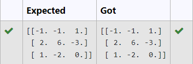

# INVERSE-OF-A-MATRIX
## Aim:
To write a python program to find the inverse of a matrix
## Equipment’s required:
1. 	Hardware – PCs
2. 	Anaconda – Python 3.7 Installation / Moodle-Code Runner
## Algorithm:
### Step1 : 
import numpy 

### Step 2: 
get input from the user

### Step 3: 
use inv() in linalg to find the inverse

### Step 4: 
print the inverse of the matrix

## Program:
```#Program to find the inverse of a matrix.
#Developed by: YOHESH KUMAR R.M
#RegisterNumber:22008459
import numpy as np
A=np.array([[6,2,3],[3,1,1],[10,3,4]])
inverse=np.linalg.inv(A)
print(inverse)
```
## Output:

## Result:
Thus the inverse of given matrix is successfully solved using python program

